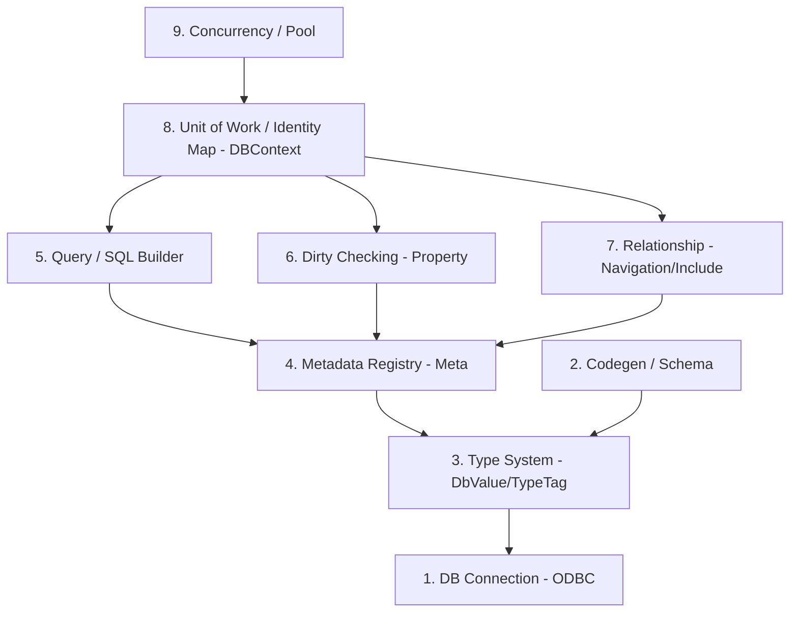

# Webzen 채팅 서버

C++20 기반 멀티스레드 채팅 서버. 웹젠 서버 직무 지원 포트폴리오로, 인프라(소켓/Job 패턴)부터 자체 ORM까지 직접 구현하는 데 초점을 맞췄다.

핵심 자랑거리는 **C++로 직접 만든 9-layer ORM** (Identity Map / Dirty Checking / Relationship / OCC 포함). C++ 진영에 SQLAlchemy/EF Core 같은 본격 ORM이 부족한 점을 직접 메우는 시도다.

---

## 기술 스택

- **언어**: C++20 (코드 생성 파이프라인은 Python)
- **빌드**: Visual Studio (`.sln`) + vcpkg (manifest 모드)
- **네트워크**: Boost.Asio (코루틴 + IOCP 백엔드)
- **DB**: MSSQL + ODBC
- **로깅**: spdlog
- **직렬화**: protobuf (패킷 자동 생성 파이프라인)
- **플랫폼**: Windows 전용

---

## 빌드 / 실행

```
# 1. vcpkg manifest 의존성 설치 (최초 1회)
vcpkg install

# 2. Visual Studio 에서 Webzen.sln 열고 빌드 (x64)

# 3. MSSQL 연결 문자열을 환경 변수 / 코드에 설정한 후 Server 실행
#    서버 시작 시 ApplySchema 가 CREATE TABLE 을 자동 적용

# 4. 같은 머신 또는 LAN 에서 Client 실행
```

클라이언트 콘솔 사용법:
- `Tab` — 채팅 모드 순환 (일반 / 확성기 / 귓속말)
- 귓속말 모드에서 `/닉네임 메시지`
- 로비에서 방 생성 / 방 리스트 / 친구 / 마이페이지 / 종료

---

## 주요 기능

### 인프라 (Phase 1-1 ~ 1-4, 1-12)
- Boost.Asio 코루틴 기반 멀티세션 (`Acceptor` + `Session::DoRead/DoWrite`)
- 자체 `JobQueue` (Room 단위 작업 직렬화, asio strand 대신 직접 구현)
- `SendBuffer` 3계층 (`SendBuffer` + `Chunk` + `Manager`) + TLS 캐시
- 패킷 디스패치 (`PacketHeader` → `GPacketHandler[id]`)
- 인프라 락 자원별 재평가: write-only 는 `std::mutex` (SendBufferManager / JobQueue), read-heavy 는 `std::shared_mutex` (RoomManager)

### 도메인 (Phase 1-5 ~ 1-14)
- 회원가입 / 로그인 (argon2id 해싱 + 화이트리스트 기반 입력 검증)
- 자체 ORM 으로 User / Room / Friendship 엔티티 관리
- 방 직접 생성 + 리스트 + 입장/퇴장 (휘발 방, 마지막 유저 퇴장 시 자동 소멸)
- 마이페이지 (닉네임 수정 UPDATE, 계정 탈퇴 DELETE)
- **친구 추가**: 요청 / 수락 / 거절 / 삭제 + 양방향 목록 조회 — ORM **Layer 7 Relationship** 실활용
- 확성기: 한 방 → 모든 방 브로드캐스트 (`RoomManager` iterate + 각 Room JobQueue 에 push)
- SessionManager 도입 + 친구 온라인 상태 표시
- 귓속말: `Tab` 토글 + `/닉네임 메시지` 형식 + 로컬 에코

---

## 자체 ORM (9-layer)

C++ 에는 런타임 리플렉션이 없어서 SQLAlchemy 식 표현식 (`Col<User>::Email == "..."`) 을 그대로 흉내낼 수 없다.
멤버 포인터 + 람다 + 메타 빌더 + 코드 생성기를 조합해 9 단계로 쌓아 올렸다.

### Layer 매핑

| Layer | 이름 | 핵심 파일 | 책임 |
|---|---|---|---|
| 1 | Connection | `DBConnection.h/cpp` | ODBC 핸들 (HENV/HDBC/HSTMT) + `BindParam`/`BindCol` 타입별 오버로드 + `Begin`/`Commit`/`Rollback` |
| 2 | Codegen / Schema | `Attributes.h`, `Tools/EntityGenerator/` | `DB_ENTITY` 마커 → `EntitiesGenerated.h` (`describe_entity` 특수화) + `CREATE TABLE` SQL 단일 소스 생성 |
| 3 | Type System | `Types.h` | `TypeTag` enum + `DbValue = std::variant<...>` 로 SQL ↔ C++ 타입 추상화 |
| 4 | Metadata Registry | `Meta.h` | `EntityMeta` / `FieldMeta` / `RelationMeta` + 람다 read/write/dirty 훅. 리플렉션 부재를 메타 빌더로 흉내 |
| 5 | Query / SQL Builder | `Sql.h`, `Column.h`, `Condition.h` | `Col<T>::Field == 5` 표현식 → `Condition`. `select/insert/update/delete_sql()` 자동 생성 + Prepared `?` 자리표시자 |
| 6 | Dirty Checking | `Property.h`, `PrimaryProperty.h` | 필드 래퍼가 `currentValue` / `originValue` / `bDirty` 보관. UPDATE SET 절에 dirty 컬럼만 포함, PK 는 mutate 차단 |
| 7 | Relationship | `Navigation.h`, `IncludeEntry.h` | `Include(&E::Nav)` → JOIN 자동 + 타겟 hydrate + `BindObj` 람다로 객체 포인터 캐싱 |
| 8 | Unit of Work / Identity Map | `DBContext.h` (`DbSet`, `Changes`, `IdentityMap`, `SaveChanges`) | 변경 추적 (ADDED/MODIFIED/DELETED) + 트랜잭션 단위 flush + PK 기반 객체 캐싱으로 중복 hydrate 방지 |
| 9 | Concurrency / Pool 통합 | `DBContext::SaveChanges` (OCC), `DBConnectionPool` | OCC: UPDATE WHERE 절을 모든 origin 컬럼으로 매칭 → 충돌 시 `OCCChanges` 로 격리 + DB 재조회. Pool: HENV 공유 + blocking cv + `DBConnectionScope` RAII |

### 의존 그래프



### 핵심 흐름 — 친구 목록 조회 + 닉네임 변경

```
Handler
  └─ DBContext ctx(conn)                               // [1][9] Pool에서 Scope로 conn 대여
      ├─ ctx.Set<User>()                                // [4] DbSet 생성
      │   .Where(Col<User>::Email == "...")             // [5] Condition 누적
      │   .Include(&User::Friends)                      // [7] IncludeEntry 누적
      │   .ToList()
      │     ├─ select_sql()                             // [5] WHERE + JOIN SQL
      │     ├─ conn->BindParam / BindCol                // [1]
      │     ├─ Fetch → Identity Map 체크                // [8]
      │     ├─ FieldMeta::Write (init)                  // [4][6] dirty=false 로 hydrate
      │     └─ Navigation::Bind                         // [7]
      │
      ├─ user->Nickname = "new"                         // [6] Property 가 dirty=true 마킹
      │
      └─ ctx.SaveChanges()
          ├─ Begin                                      // [1]
          ├─ dirty 스캔 → MODIFIED 등록                 // [6][8]
          ├─ update_sql(dirtyOnly)                      // [5][6]
          ├─ WHERE OCC = origin 컬럼 전부               // [9]
          ├─ rowCount == 0 → OCCChanges 격리            // [9]
          ├─ Commit + ApplyChange (clear_dirty)         // [6][8]
          └─ 실패 시 Rollback + OCC 객체 재조회         // [9]
```

---

## 동시성 전략

| 자원 | 락 / 동기화 | 이유 |
|---|---|---|
| Room (게임 로직) | 자체 `JobQueue` 직렬화 | 액터 모델. asio strand 대신 직접 구현으로 제어권 확보 |
| SendBufferManager | `std::mutex` | write-only 패턴, 임계영역 짧음, Windows MSVC `std::mutex` = SRWLOCK 백엔드 |
| JobQueue | `std::mutex` | 위와 동일 |
| RoomManager | `std::shared_mutex` | read-heavy (FindRoom / GetRoomList / 확성기 iterate) |
| SessionManager | `std::shared_mutex` | read-heavy (IsOnline / GetSession), Register/Unregister 만 write |
| Session 소켓 I/O | asio strand | async 연산과 자연스럽게 결합 |
| TLS | `LThreadId`, `LSendBufferChunk` | 스레드별 독립 자원, 경합 제거 |
| ORM 동시성 | 요청당 `DBContext` 격리 + Pool 의 conn 한 스레드 전유 | 자료구조에 mutex 얹는 대신 공유 자체를 구조적으로 제거 |

---

## 알려진 한계 / 개선 여지

포트폴리오 범위 컨트롤상 의식적으로 보류한 항목들. 면접 답변 재료.

- **빌드 자동화 미통합**: `GenPackets.bat` / `EntityGenerator.py` 수동 실행. `<PreBuildEvent>` 로 묶을 여지.
- **클라 응답 플래그 선형 누적**: 기능마다 `Atomic<bool>` 2개 (`Done`/`Success`). `Map<RequestId, ResponseState>` 기반 응답 저장소로 대체 가능.
- **핸들러 검증 중복**: 친구/마이페이지 핸들러들이 "이메일 검증 → 로그인 체크 → DB Scope → 조회" 패턴을 반복. `HandlerPrelude` 로 추출 가능.
- **ORM `BindParam`/`BindCol` switch 산재**: `DbValue`/`TypeTag` 분기가 `ToList` / `SaveChanges` / OCC 경로에 4회 중복. `DbValueBinder` 로 일원화 가능.
- **Include 의 INNER JOIN 고정**: FK NULL / 참조 삭제 시 메인 행 누락. LEFT JOIN 옵션 + projection (특정 컬럼만 SELECT) 까지 가야 운영 ORM 수준.
- **Room JobQueue 단일화**: state 와 broadcast 가 동일 큐 → 한 워커만 처리. state queue / chat queue 분리 시 Sessions 동시 접근 대책 (RWLock or copy-on-write 스냅샷) 필요.

---

## 디렉토리 구조

```
Webzen/
├── ServerCore/         # 인프라 (Lock, JobQueue, Session, SendBuffer, ThreadManager)
├── Server/
│   ├── Network/        # Listener, ClientPacketHandler, Room, RoomManager, SessionManager
│   ├── DB/
│   │   ├── ORM/        # 9-layer ORM (DBConnection, Property, Meta, DBContext, Sql, Navigation 등)
│   │   ├── Entities/   # 도메인 엔티티 (User, Friendship 등) + DB_ENTITY 마커
│   │   └── Generated/  # codegen 산출물 (EntitiesGenerated.h)
│   └── Security/       # InputValidator (화이트리스트 검증), Argon2 해싱
├── Client/             # 콘솔 클라 (ClientApp / ClientSession / ConsoleUI / ServerPacketHandler)
├── Proto/              # *.proto 단일 소스
└── Tools/
    ├── PacketGenerator/    # *.proto → C++ 패킷 핸들러 자동 생성
    └── EntityGenerator/    # Entities/*.h → EntitiesGenerated.h + CREATE TABLE SQL
```
