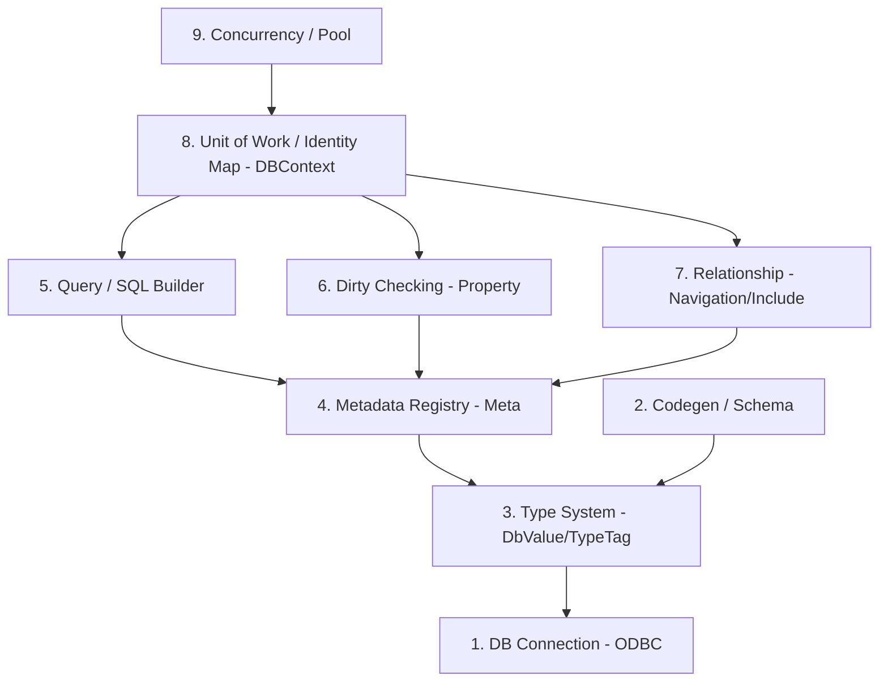

# ChatServer

C++20 으로 만든 멀티스레드 채팅 서버. 채팅이라는 가벼운 도메인 위에 **원장(元帳) 시스템이 요구하는 것** 을 얹는 데 초점을 맞췄다. 트랜잭션 단위 flush, 낙관적 동시성 제어(OCC), 커넥션 풀, prepared statement, 그리고 요청이 몰려도 워커가 멈추지 않는 I/O 구조다.

소켓 계층부터 자체 ORM 까지 라이브러리에 기대지 않고 직접 구현했다. 어떤 SQL 이 나가는지, 어떤 락이 걸리는지, 어느 스레드가 무엇을 처리하는지를 전부 설명할 수 있는 상태를 목표로 했다.

---

## 목차

1. [증권 시스템에 대입하면](#증권-시스템에-대입하면)
2. [기술 스택](#기술-스택)
3. [빌드 / 실행](#빌드--실행)
4. [트랜잭션과 동시성 제어 (OCC)](#트랜잭션과-동시성-제어-occ)
5. [보안](#보안)
6. [인덱스와 락 힌트](#인덱스와-락-힌트)
7. [서버 인프라와 락 전략](#서버-인프라와-락-전략)
8. [AI 채팅 — 외부 API 를 비동기로 붙이기](#ai-채팅--외부-api-를-비동기로-붙이기)
9. [자체 ORM (9-layer)](#자체-orm-9-layer)
10. [주요 기능](#주요-기능)
11. [성능 측정](#성능-측정)
12. [로드맵](#로드맵)
13. [알려진 한계 / 개선 여지](#알려진-한계--개선-여지)
14. [디렉토리 구조](#디렉토리-구조)

---

## 증권 시스템에 대입하면

금융 시스템은 고객이 조작하는 **채널** 과, 계좌·잔고의 진실을 쥔 **원장** 으로 나뉜다. 채널이 받은 요청을 원장이 트랜잭션으로 처리하고 결과를 돌려준다. 이 프로젝트는 그 구조를 같은 형태로 축소했다.

```
콘솔 클라이언트 ──▶ 서버 ──▶ 자체 ORM ──▶ MSSQL
(채널: 바이너리 패킷)   (IOCP · JobQueue)   (트랜잭션 · OCC · 풀)   (User · Friendship)
```

| 금융 시스템 | 역할 | 이 프로젝트에서 대응되는 것 |
|---|---|---|
| 채널 (HTS / MTS) | 고객이 직접 조작하는 창구 | Windows C++ 콘솔 클라이언트, protobuf 바이너리 프로토콜, 패킷 핸들러 자동 생성 |
| 원장 (계정계) | 계좌·잔고·체결의 진실. 정합성이 생명 | `DBContext` 트랜잭션 단위 flush, OCC 충돌 감지, 커넥션 풀 RAII, prepared statement |
| 대량 트랜잭션 처리 | 요청이 몰려도 지연 없이 | IOCP 코루틴, 자원별 mutex / shared_mutex 구분, TLS 송신 버퍼, Room 단위 JobQueue 직렬화 |
| 보안 · 장애 대응 | 인젝션 차단, 장애 격리와 복구 | prepared statement, 화이트리스트 입력 검증, bcrypt, 실패 시 전체 Rollback, 풀 반납 보장 |
| AI 서비스 | 고객 응대·정보 제공 | Claude API 를 같은 io_context 위에서 비동기 스트리밍, 이력 DB 저장, 유저·일 단위 한도, 실패 분류·재시도 |

---

## 기술 스택

- **언어**: C++20 (코드 생성 파이프라인은 Python)
- **빌드**: Visual Studio (`.sln`) + vcpkg (manifest 모드)
- **네트워크**: Boost.Asio (코루틴 + IOCP 백엔드)
- **DB**: MSSQL + ODBC
- **로깅**: spdlog
- **직렬화**: protobuf (패킷 자동 생성 파이프라인)
- **비밀번호 해싱**: bcrypt (Openwall crypt_blowfish 를 `ServerCore/ThirdParty/bcrypt` 에 vendoring)
- **AI**: Claude Messages API (raw HTTP), asio::ssl + OpenSSL, nlohmann-json
- **플랫폼**: Windows 전용

---

## 빌드 / 실행

```
# 1. vcpkg manifest 의존성 설치 (최초 1회)
vcpkg install

# 2. SQL Server Express 에 데이터베이스 생성 (서버는 테이블만 만들고 DB 는 만들지 않음)
#    CREATE DATABASE ChatServerDB;

# 3. Visual Studio 에서 ChatServer.sln 열고 빌드 (x64)

# 4. Server 실행
#    시작 시 InitDB 가 엔티티 메타에서 CREATE TABLE 을 생성해 적용하고,
#    기존 테이블에 없는 컬럼은 ALTER TABLE ADD 로 보강하고, 없는 인덱스는 CREATE INDEX 한다

# 5. 같은 머신 또는 LAN 에서 Client 실행 (기본 포트 9000)
```

연결 문자열은 `Server/ServerApp.cpp` 상단에 있다. 로컬 `.\SQLEXPRESS` + Windows 인증이 기본값이다.
AI 채팅을 쓰려면 `ANTHROPIC_API_KEY` 환경 변수가 필요하다 (없으면 그 기능만 꺼진다). 상세는 [AI 채팅](#ai-채팅--외부-api-를-비동기로-붙이기).

클라이언트 콘솔 사용법:
- `Tab` — 채팅 모드 순환 (일반 / 확성기 / 귓속말 / AI)
- 귓속말 모드에서 `/닉네임 메시지`
- 로비에서 방 생성 / 방 리스트 / 친구 / 마이페이지 / 종료

---

## 트랜잭션과 동시성 제어 (OCC)

두 요청이 같은 행을 동시에 고칠 때, 락을 잡지 않고 충돌을 감지한 뒤 트랜잭션 단위로 되돌린다. `DBContext::SaveChanges` 한 번이 아래 흐름 전체다.

```
SaveChanges()
  ├─ Begin                                        // [L1] AutoCommit OFF, 명시적 트랜잭션
  ├─ Identity Map 전체 dirty 스캔 → MODIFIED 등록  // [L6][L8]
  ├─ UPDATE SET 절: 바뀐 컬럼만                    // [L5][L6]
  ├─ WHERE 절: 로드 시점 값(origin) 을 모든 컬럼에 매칭   // [L9]  ← OCC
  ├─ rowCount == 0 → 누군가 먼저 바꿈 → OCCChanges 로 격리  // [L9]
  ├─ 전부 성공 → Commit + origin 갱신, dirty 해제  // [L1][L8]
  └─ 하나라도 실패 → 전체 Rollback + 충돌 객체 DB 재조회   // [L1][L9]
```

### 왜 락이 아니라 낙관적 방식인가

- **충돌이 드문 도메인** 에서는 락 대기 비용보다 "실패하면 다시" 가 싸다. 닉네임 변경, 친구 관계 갱신이 그렇다.
- 반대로 **잔고처럼 충돌이 잦고 실패 비용이 큰 곳** 은 비관적 락(`UPDLOCK`) 이 맞다. 아래 포인트 이체를 같은 부하로 두 방식 돌려 비교했다 → [OCC vs UPDLOCK](#occ-vs-updlock--같은-부하-락-방식만-교체).
- 버전 컬럼 대신 **origin 값 전체 비교** 를 택했다. 스키마 변경 없이 Dirty Checking 계층이 이미 보관하는 값을 재활용한다. 컬럼이 많아지면 버전 컬럼이 유리해지는 트레이드오프는 알고 있다.
- 충돌 객체를 **따로 격리** 해 두는 이유는, 핸들러가 "무엇이 충돌했는지" 를 알고 재시도 정책을 정하게 하기 위해서다.

### 포인트 이체 — 한 트랜잭션에 두 행

원장의 가장 기본적인 동작을 축소한 시나리오. `Handle_C_TRANSFER` (`Server/Network/ClientPacketHandler.cpp`).

```
for (retry = 0; retry <= kMaxTransferRetry; ++retry)     // 상한 3회
{
    DBContext ctx(conn);                                   // 매 시도마다 새 컨텍스트 = 두 계좌를 DB 에서 다시 읽음
    from = ctx.Set<User>().Where(Id == me).ToList()
    to   = ctx.Set<User>().Where(Nickname == target).ToList()
    if (from.Balance < amount) return Fail("Insufficient balance");
    from.Balance -= amount;  to.Balance += amount;         // Property 가 dirty 마킹
    if (ctx.SaveChanges()) return Ok(from.Balance, retry); // 2행 UPDATE, 1 트랜잭션, WHERE = origin 전체
    if (!ctx.HadOCCConflict()) return Fail("Database error"); // DB 오류는 재시도 안 함
}
return Fail("Transfer failed after retries");
```

- **원자성**: 출금과 입금이 둘 다 되거나 둘 다 안 된다. 하나라도 rowCount 0 이면 전체 Rollback.
- **잔고 검증 이후 남이 먼저 빼갔다면** OCC 가 잡아서 재조회 후 재시도한다. 재시도 상한을 두어 무한 루프와 기아를 막는다.
- **데드락 없음**: 두 UPDATE 는 Identity Map 순회 순서(= PK 오름차순)로 나간다. A→B 와 B→A 가 동시에 와도 락 획득 순서가 같다.
- **재시도 판단**: `DBContext::HadOCCConflict()` 로 "다시 하면 될 실패" 와 "다시 해도 안 되는 실패(DB 오류)" 를 구분한다.
- 수신자가 온라인이면 `S_TRANSFER_RECEIVED` 를 push 해 잔고를 즉시 갱신한다.

동시성 검증은 `Tools/LoadTest/transfer_test.py` 로 한다 (아래 [성능 측정](#성능-측정)). 회원가입 시 초기 잔고 10,000 P 를 지급한다.

### 커넥션 풀

- ODBC 환경 핸들(HENV) 은 풀이 하나만 소유하고 모든 연결이 공유한다.
- `Pop` 은 가용 연결이 없으면 `condition_variable` 로 대기한다. 규모가 크지 않아 컨텍스트 스위치 비용은 감수하고 정확성을 우선했다.
- `DBConnectionScope` RAII 래퍼가 예외나 조기 return 에서도 반납을 보장한다.

---

## 보안

| 항목 | 방식 | 이유 |
|---|---|---|
| SQL 인젝션 | ORM 의 SQL 빌더가 값을 문자열에 섞지 않는다. 모든 값은 `?` 자리표시자 + ODBC `BindParam` 타입별 바인딩 | 개발자가 실수할 경로 자체를 없앤다 |
| 입력 검증 | 이메일은 정규식, 이름·비밀번호는 길이 규칙. 허용 규칙만 통과시키는 화이트리스트 방식 | 금지 문자를 나열하는 블랙리스트는 빠뜨리기 쉽다 |
| 비밀번호 | bcrypt (`$2b$`, cost 12) 해시만 저장. 검증된 구현(Openwall crypt_blowfish)을 vendoring 했고 직접 짠 암호 코드는 없다. 해싱 도입 전 평문 행은 로그인 성공 시점에 해시로 승격 | salt 가 해시 문자열 안에 들어 있어 같은 비밀번호도 매번 다른 해시. cost 로 일부러 느리게(≈250 ms) 만들어 유출 시 무차별 대입 비용을 올린다 |
| 자격 증명 | 외부 API 키는 환경 변수로만 읽는다. 저장소에 두지 않는다 | 공개 저장소 |
| 장애 격리 | DB 커넥션은 RAII 반납, 트랜잭션은 실패 시 전체 Rollback | 부분 반영으로 정합성이 깨지는 것을 막는다 |

---

## 인덱스와 락 힌트

인덱스는 엔티티 선언의 표식에서 코드젠이 만들고, 서버 시작 시 없는 것만 생성한다 (`IF NOT EXISTS ... CREATE INDEX`). 힌트는 이 프로젝트가 다루는 두 가지, `NOLOCK` 과 `UPDLOCK` 만 지원한다.

### 인덱스 설계 — 조회 경로에서 역산

```cpp
DB_ENTITY
struct User
{
    PrimaryProperty<int64>                Id;
    UNIQUE LEN(100) Property<std::string> Email;      // 로그인 · 회원가입 중복 체크
    INDEX  LEN(60)  Property<std::string> Nickname;   // 귓속말 · 친구 요청 · 이체 대상 조회
    LEN(256)        Property<std::string> Password;
    Property<int64>                       Balance;
};

DB_ENTITY
struct Friendship
{
    /* ... */
    COMPOSITE_UNIQUE(FromUserId, ToUserId);   // 같은 방향 중복 요청 차단 + 양방향 조회
    COMPOSITE_INDEX(ToUserId, Status);        // 받은 요청 목록
};
```

`LEN(n)` 이 먼저다. 원래 문자열 컬럼이 전부 `NVARCHAR(4000)` 이었는데, MSSQL 비클러스터 인덱스 키 상한이 1,700 바이트라 그대로 인덱스를 걸면 경고가 나고 긴 값에서 INSERT 가 실패한다. 표식으로 길이를 선언하고, 코드젠이 `NVARCHAR(n)` 과 인덱스를 함께 만든다. 표식은 전부 빈 매크로라 컴파일러는 평범한 C++ 을 보고 생성기만 스키마를 본다.

| 인덱스 | 컬럼 | 근거가 되는 조회 경로 |
|---|---|---|
| `UX_User_Email` | Email (UNIQUE) | 로그인, 회원가입 중복 체크 |
| `IX_User_Nickname` | Nickname | 귓속말, 친구 요청, 이체 대상 조회 |
| `UX_Friendship_FromUserId_ToUserId` | (FromUserId, ToUserId) UNIQUE | 같은 방향 중복 요청 차단 + 양방향 조회 |
| `IX_Friendship_ToUserId_Status` | (ToUserId, Status) | 받은 요청 목록 |

### 실행 계획 — 있을 때와 없을 때 (유저 10,020행)

`SET SHOWPLAN_TEXT ON` / `SET STATISTICS IO ON` 으로 측정. 원본은 `docs/plan_10k_with_index.txt`, `docs/plan_10k_no_index.txt`, 재현 스크립트는 `docs/plan_10k_probe.sql`.

| 조회 | 인덱스 없음 | 인덱스 있음 |
|---|---|---|
| `WHERE Nickname = ?` | Clustered Index Scan, 논리 읽기 **147** | Index Seek (`IX_User_Nickname`) + Key Lookup, 논리 읽기 **4** |
| `WHERE Email = ?` | Clustered Index Scan, 논리 읽기 **147** | Index Seek (`UX_User_Email`) + Key Lookup, 논리 읽기 **4** |

```
-- 인덱스 없음
|--Clustered Index Scan(OBJECT:([User].[PK__User__...] AS [t0]), WHERE:([t0].[Nickname]=[@1]))

-- 인덱스 있음
|--Nested Loops(Inner Join, OUTER REFERENCES:([t0].[Id]))
     |--Index Seek(OBJECT:([User].[IX_User_Nickname] AS [t0]), SEEK:([t0].[Nickname]=N'bulk5000') ORDERED FORWARD)
     |--Clustered Index Seek(OBJECT:([User].[PK__User__...] AS [t0]), SEEK:([t0].[Id]=[t0].[Id]) LOOKUP ORDERED FORWARD)
```

배운 것 하나. 행이 20개일 때는 인덱스가 있어도 옵티마이저가 Nickname 조회에 **Scan 을 골랐다**. 한 페이지를 훑는 비용이 인덱스를 타고 Key Lookup 으로 되돌아오는 비용보다 싸다고 판단한 것이다. 인덱스는 "있으면 쓰인다" 가 아니라 "통계상 싸면 쓰인다". 그래서 실행 계획은 실제 규모의 데이터로 봐야 한다.

Key Lookup 이 남는 이유는 SELECT 가 모든 컬럼을 읽기 때문이다. 없애려면 INCLUDE 컬럼(covering index) 이 필요한데, 이 규모에서는 이득이 없어 보류했다.

### NOLOCK / UPDLOCK / OCC — 조회 성격에 따라 고른다

| 방식 | 동작 | 쓰는 곳 |
|---|---|---|
| `NOLOCK` | 락을 걸지도 기다리지도 않는다. 커밋 안 된 행을 읽을 수 있다 | 방 리스트, 친구 목록처럼 **잠깐 틀려도 되는 조회**. 잔고·정산에는 금지 |
| `UPDLOCK` | 읽는 시점에 갱신 락. 트랜잭션 끝까지 남이 못 고친다 | 잔고처럼 **충돌 잦고 실패 비용 큰 갱신** |
| OCC | 락 없이 읽고, UPDATE 시 origin 비교로 충돌 감지 | 닉네임, 친구 관계처럼 **충돌 드문 갱신** |

**적용 방식.** `DbSet::WithHint(Hint::NoLock)` 이 `FROM [T] t0 WITH (NOLOCK)` 을 만든다. `UPDLOCK` 은 `DBContext::BeginTransaction()` 뒤에 써야 Commit 까지 락이 유지된다 (autocommit 이면 문장 끝에서 풀린다). 트랜잭션을 열어 두고 검증 실패로 빠져나가면 `DBContext` 소멸자가 Rollback 해서 락을 푼다.

- `NOLOCK` 적용: 친구 목록, 받은 요청 목록 (`Handle_C_GET_FRIEND_LIST`, `Handle_C_GET_PENDING_FRIENDS`). 잔고 조회에는 쓰지 않는다.
- `UPDLOCK` 적용: 이체. 환경 변수 `CHATSERVER_TRANSFER_LOCK=updlock` 으로 켠다 (기본은 OCC). 대상 Id 를 먼저 찾고, 트랜잭션을 연 뒤 **PK 오름차순** 으로 두 행을 `WITH (UPDLOCK, ROWLOCK)` 조회한다. 순서를 고정해야 A→B 와 B→A 가 교착하지 않는다.

### OCC vs UPDLOCK — 같은 부하, 락 방식만 교체

`transfer_test.py --users 10 --rounds 5` (허브 계좌 집중 + 양방향 교차, 90건 동시 이체). 재빌드 없이 환경 변수만 바꿔 두 번 돌렸다.

| | OCC (낙관적) | UPDLOCK (비관적) |
|---|---|---|
| 성공 / 실패 | 81 / 9 (재시도 3회 초과) | **90 / 0** |
| OCC 재시도 | 41회 | 0회 |
| 소요 | 0.62 s | 0.60 s |
| 잔고 총합 보존 | OK | OK |
| 데드락 | 0 | 0 |

한 계좌에 요청이 몰리는 잔고 갱신에서는 UPDLOCK 이 맞다. 경쟁 요청이 실패하는 대신 줄을 서고, 처리량도 잃지 않았다. OCC 는 충돌이 드문 닉네임·친구 관계 갱신에 남긴다. 선택 기준은 **충돌 빈도와 실패 비용** 이다. OCC 수치는 실행마다 몇 건씩 흔들린다 (첫 실행 76 / 14).

---

## 서버 인프라와 락 전략

### I/O 와 작업 분배

- Boost.Asio 코루틴 기반 멀티세션 (`Acceptor` + `Session::DoRead/DoWrite`). 콜백 중첩 없이 순차 코드처럼 읽힌다.
- `context.poll()` 을 택했다. `run()` 은 큐가 비면 스레드를 재우고 매번 커널을 부르는 비용이 누적된다. 작업량이 많은 서버 로직에서는 재우지 않고 바로 다음 작업을 잡는 쪽이 낫다.
- 자체 `JobQueue` 로 I/O 이벤트와 비즈니스 로직을 분리. Room 하나의 작업은 한 번에 한 워커만 처리하므로 방 상태에 락이 필요 없다 (액터 모델). asio strand 대신 직접 구현해 제어권을 확보했다.
- `SendBuffer` 3계층 (`SendBuffer` + `Chunk` + `Manager`) + TLS 캐시로 송신 경합 제거.
- 패킷 디스패치: `PacketHeader` → `GPacketHandler[id]`. protobuf 정의에서 핸들러 골격을 자동 생성.

### 자원별 락 선택

"같은 락을 어디서나" 가 아니라 호출 패턴(read / write 비율) 에 따라 종류와 범위를 구분했다.

| 자원 | 락 / 동기화 | 이유 |
|---|---|---|
| Room (게임 로직) | 자체 `JobQueue` 직렬화 | 액터 모델. asio strand 대신 직접 구현으로 제어권 확보 |
| SendBufferManager | `std::mutex` | write-only 패턴, 임계영역 짧음, Windows MSVC `std::mutex` = SRWLOCK 백엔드 |
| JobQueue | `std::mutex` | 위와 동일 |
| RoomManager | `std::shared_mutex` | read-heavy (FindRoom / GetRoomList / 확성기 iterate) |
| SessionManager | `std::shared_mutex` | read-heavy (IsOnline / GetSession), Register/Unregister 만 write |
| Session 송신 큐 | `std::mutex` (짧은 임계영역) | `Send()` 는 아무 스레드에서나 불리고 `DoWrite` 코루틴도 아무 워커에서나 돈다. 큐와 "쓰는 중" 플래그를 락 안에서만 만진다. 아래 "부하 테스트가 잡은 버그" 참고 |
| TLS | `LThreadId`, `LSendBufferChunk` | 스레드별 독립 자원, 경합 제거 |
| ORM 동시성 | 요청당 `DBContext` 격리 + Pool 의 conn 한 스레드 전유 | 자료구조에 mutex 얹는 대신 공유 자체를 구조적으로 제거 |

### 부하 테스트가 잡은 버그 — 보호 없이 공유되던 송신 큐

이 표의 원래 버전에는 "Session 소켓 I/O: asio strand" 라고 적혀 있었지만, 코드에는 strand 도 락도 없었다. 소켓 executor 가 io_context 그 자체였고, `Send()` 가 post 한 핸들러와 `DoWrite` 코루틴이 워커 24개 중 아무 스레드에서나 돌면서 `WriteQueue` 와 `bIsWriting` 을 동시에 만졌다.

- **증상**: 50명 방에서 브로드캐스트 부하를 주자 `Write error: 잘못된 포인터 주소` (WSAEFAULT) 와 메시지 유실 5건. 같은 테스트를 다시 돌리자 서버 크래시.
- **진단**: 유실 패턴을 (수신자, 송신자, 순번) 으로 찍어 보니 특정 세션에 몰림 → 세션 단위 자료구조 경합. 코드를 보니 큐를 보호하는 것이 아무것도 없었다.
- **수정**: 송신 큐와 "쓰는 중" 플래그를 `std::mutex` 로 보호한다. `Send()` 는 락 안에서 push 하고 플래그를 세운 뒤 락 밖에서 `DoWrite` 를 띄운다. `DoWrite` 는 락 안에서 하나 꺼내고 락을 놓은 뒤 `async_write` 를 기다린다 (I/O 대기 중에는 락을 잡지 않는다). "큐가 비었다" 와 "플래그 해제" 는 같은 락 안에서 처리해 그 사이 들어온 `Send` 가 새 `DoWrite` 를 띄울지 정확히 판단한다. 쓰기 오류가 나면 큐를 비우고 `Disconnect` 해서 정리 경로로 보낸다.
- **왜 strand 가 아니라 mutex 인가**: asio 가 권하는 정석은 세션마다 strand 를 두고 모든 핸들러를 그 위에서 도는 것이다. 그 방식도 구현해 같은 부하를 통과시켰지만, 이 프로젝트의 다른 자원(JobQueue, SendBufferManager) 과 같은 도구인 "짧은 임계영역의 mutex" 로 통일했다. 남는 한계: 소켓 객체 자체는 여전히 여러 스레드가 만진다 (읽기 코루틴과 쓰기 코루틴, `Disconnect`). asio 문서상 완전한 답은 strand 이며, 이 트레이드오프를 알고 선택했다.
- **검증**: 같은 부하 50명 3회 + 100명 2회 (초당 10건 / 30건), 유실 0 · 쓰기 오류 0 · 서버 생존. 100명 30건/s 에서 300,000건 전달, 약 170,000 deliveries/s.

소규모 수동 테스트로는 몇 달 동안 드러나지 않던 경합이 자동 부하 테스트 첫 실행에서 나왔다. "동시성 버그는 테스트가 아니라 부하가 찾는다" 는 걸 몸으로 배운 사례.

---

## AI 채팅 — 외부 API 를 비동기로 붙이기

채팅방에서 `Tab` 으로 AI 모드를 고르면 입력이 Claude API 로 가고, 응답이 생성되는 대로 조각 단위로 돌아온다.

```
클라 [AI] ─C_AI_CHAT─▶ 핸들러 ─co_spawn(세션 strand)─▶ AiChatService
                                                       ├─ 한도 검사            AiUsage (유저·일 단위)
                                                       ├─ 유저 메시지 저장      AiMessage
                                                       ├─ 최근 20행 이력 로드   ORDER BY CreatedAt DESC, TOP 20
                                                       ├─ Claude::StreamMessage ─ HTTPS POST /v1/messages (stream: true)
                                                       │     └─ SSE text_delta 마다 ─S_AI_CHAT{text}─▶ 클라 (줄 단위로 화면에)
                                                       └─ 응답 저장 + 사용량 갱신 ─S_AI_CHAT{done}─▶ 클라
```

### 설계 결정

- **워커를 멈추지 않는다.** HTTP 클라이언트가 서버와 같은 io_context 위의 코루틴이라 API 응답을 기다리는 동안 스레드를 점유하지 않는다. 핸들러는 코루틴을 띄우고 바로 돌아간다.
- **Boost.Beast 대신 독립형 asio + OpenSSL.** 이 프로젝트는 독립형 asio 를 쓰고 Beast 는 Boost.Asio 에만 붙는다. Beast 를 쓰려면 전체를 Boost 로 옮겨야 해서, 필요한 만큼(HTTP/1.1 POST, chunked 본문, TLS)만 `Server/AI/HttpClient` 로 직접 구현했다. 범위 밖: 리다이렉트, keep-alive, HTTP/2, 압축. 엔드포인트가 고정이라 필요 없다.
- **TLS 검증을 끄지 않았다.** OpenSSL 의 기본 신뢰 경로는 Windows 에서 비어 있다. Windows 루트 인증서 저장소를 OpenSSL 신뢰 저장소로 옮겨 넣고 `verify_peer` + 호스트명 검증 + SNI 를 켰다.
- **SSE 파서는 분리.** HTTP 조각은 이벤트 경계와 무관하게 잘려 오므로 줄 단위 상태 기계(`SseParser`)가 `event:` / `data:` 를 모아 이벤트를 조립한다.
- **이력은 DB.** API 는 이전 대화를 기억하지 않는다. `AiMessage` 에 저장하고 요청마다 최근 20행을 실어 보낸다. 이를 위해 ORM 에 `OrderBy` / `Take` (ORDER BY / TOP) 를 추가했다. 실패한 호출 뒤 연속된 user 메시지는 합쳐서 역할이 번갈아가게 만든다.
- **한도 = 원장의 축소판.** `AiUsage(UserId, Day)` 에 호출 수·입력/출력 토큰을 누적. 일일 호출·토큰 상한 초과 시 거절.
- **실패 분류.** 429 는 Retry-After 만큼(최대 5초) 기다려 재시도, 5xx·네트워크 오류는 1초 뒤 재시도(최대 3회), 400/401/404 는 즉시 실패. 이미 텍스트가 클라로 나간 뒤에는 재시도하지 않는다(중복 출력 방지). 안전 분류기 거부(`stop_reason: refusal`) 는 정중한 한 줄로 바꾼다.
- **한 세션에 하나.** 응답이 흐르는 중에 다시 보내면 거절한다. 두 스트림이 섞이면 화면이 깨진다.
- **API 키는 환경 변수만.** `ANTHROPIC_API_KEY` 가 없으면 AI 기능만 꺼지고 서버는 뜬다. 저장소에 키가 들어갈 경로가 없다.
- **비용·지연.** 채팅 용도라 `output_config.effort: low`, `max_tokens 1024`. 시스템 프롬프트는 고정 문자열(프롬프트 캐시 프리픽스 유지).

### 검증

- **모의 서버** `Tools/LoadTest/mock_claude_server.py`: 실제 API 와 같은 SSE 이벤트를 chunked 로 흘린다. 429/500 한 번 실패, refusal, 스트림 도중 error, 느린 응답 시나리오.
- **통합 테스트** `Tools/LoadTest/ai_chat_test.py` 11개 항목 전부 통과: 조각 스트리밍, 이력 3건 전송, 429·500 재시도 후 성공, refusal, 스트림 오류, 진행 중 중복 요청 거절, 일일 한도, DB 저장, 사용량 집계.
- **실제 엔드포인트 TLS**: 더미 키로 `api.anthropic.com` 에 붙여 `HTTP 401: API key is invalid.` 를 받았다. TLS 핸드셰이크·인증서 검증·SNI·응답 파싱이 실제 서버에서 동작한다는 뜻이다. 실제 응답 스트리밍은 유효한 키를 넣어야 확인된다.

### 환경 변수

| 변수 | 기본 | 설명 |
|---|---|---|
| `ANTHROPIC_API_KEY` | (없음) | 없으면 AI 기능 비활성 |
| `ANTHROPIC_BASE_URL` | `https://api.anthropic.com` | 모의 서버 테스트 시 `http://127.0.0.1:8765` |
| `CHATSERVER_AI_MODEL` | `claude-opus-5` | |
| `CHATSERVER_AI_EFFORT` | `low` | 채팅 용도라 지연·비용 우선 |
| `CHATSERVER_AI_FALLBACKS` | `1` | 거부 시 서버측 대체 모델 (베타 헤더). `0` 이면 끔 |
| `CHATSERVER_AI_DAILY_CALLS` / `CHATSERVER_AI_DAILY_TOKENS` | 50 / 100000 | 유저·일 단위 한도 |

---

## 자체 ORM (9-layer)

### 왜 직접 만들었나 — 원장은 raw SQL 을 쓰는데

금융 원장 개발은 보통 ORM 없이 SQL 을 직접 짠다. 실행 계획을 통제해야 하기 때문이다. 그걸 알면서 ORM 을 만든 이유는 하나다. **SQL 빌더 계층(L5) 을 직접 짰기 때문에 어떤 SQL 이 나가는지 전부 안다.** UPDATE 는 dirty 컬럼만, WHERE 는 origin 전체, 값은 전부 바인딩. 필요하면 `DBConnection::Execute` 로 raw SQL 을 그대로 쓴다. ORM 은 SQL 을 숨기는 도구가 아니라 SQL 을 이해한 결과물이어야 한다는 생각으로 설계했다.

C++ 에는 런타임 리플렉션이 없어서 SQLAlchemy 식 표현식 (`Col<User>::Email == "..."`) 을 그대로 흉내낼 수 없다. 멤버 포인터 + 람다 + 메타 빌더 + 코드 생성기를 조합해 9 단계로 쌓아 올렸다.

### Layer 매핑

| Layer | 이름 | 핵심 파일 | 책임 |
|---|---|---|---|
| 1 | Connection | `DBConnection.h/cpp` | ODBC 핸들 (HENV/HDBC/HSTMT) + `BindParam`/`BindCol` 타입별 오버로드 + `Begin`/`Commit`/`Rollback` |
| 2 | Codegen / Schema | `Attributes.h`, `Tools/EntityGenerator/` | `DB_ENTITY` / `LEN(n)` / `INDEX` / `UNIQUE` / `COMPOSITE_*` 마커 → `EntitiesGenerated.h` (`describe_entity` 특수화) + `CREATE TABLE` / `ALTER TABLE ADD` / `CREATE INDEX` SQL 단일 소스 생성 |
| 3 | Type System | `Types.h` | `TypeTag` enum + `DbValue = std::variant<...>` 로 SQL ↔ C++ 타입 추상화 |
| 4 | Metadata Registry | `Meta.h` | `EntityMeta` / `FieldMeta` / `RelationMeta` + 람다 read/write/dirty 훅. 리플렉션 부재를 메타 빌더로 흉내 |
| 5 | Query / SQL Builder | `Sql.h`, `Column.h`, `Condition.h` | `Col<T>::Field == 5` 표현식 → `Condition`. `select/insert/update/delete_sql()` 자동 생성 + Prepared `?` 자리표시자 + 테이블 힌트 (`WithHint`) + 정렬·상위 N (`OrderBy` / `Take`) |
| 6 | Dirty Checking | `Property.h`, `PrimaryProperty.h` | 필드 래퍼가 `currentValue` / `originValue` / `bDirty` 보관. UPDATE SET 절에 dirty 컬럼만 포함, PK 는 mutate 차단 |
| 7 | Relationship | `Navigation.h`, `IncludeEntry.h` | `Include(&E::Nav)` → JOIN 자동 + 타겟 hydrate + `BindObj` 람다로 객체 포인터 캐싱 |
| 8 | Unit of Work / Identity Map | `DBContext.h` (`DbSet`, `Changes`, `IdentityMap`, `SaveChanges`) | 변경 추적 (ADDED/MODIFIED/DELETED) + 트랜잭션 단위 flush + PK 기반 객체 캐싱으로 중복 hydrate 방지 |
| 9 | Concurrency / Pool 통합 | `DBContext::SaveChanges` (OCC), `DBConnectionPool` | OCC: UPDATE WHERE 절을 모든 origin 컬럼으로 매칭 → 충돌 시 `OCCChanges` 로 격리 + DB 재조회. 명시적 트랜잭션 (`BeginTransaction`) 으로 UPDLOCK 조회 지원. Pool: HENV 공유 + blocking cv + `DBConnectionScope` RAII |

### 의존 그래프



### 핵심 흐름 — 친구 목록 조회 + 닉네임 변경

```
Handler
  └─ DBContext ctx(conn)                               // [1][9] Pool에서 Scope로 conn 대여
      ├─ ctx.Set<User>()                                // [4] DbSet 생성
      │   .Where(Col<User>::Email == "...")             // [5] Condition 누적
      │   .Include(&User::Friends)                      // [7] IncludeEntry 누적
      │   .ToList()
      │     ├─ select_sql()                             // [5] WHERE + JOIN SQL
      │     ├─ conn->BindParam / BindCol                // [1]
      │     ├─ Fetch → Identity Map 체크                // [8]
      │     ├─ FieldMeta::Write (init)                  // [4][6] dirty=false 로 hydrate
      │     └─ Navigation::Bind                         // [7]
      │
      ├─ user->Nickname = "new"                         // [6] Property 가 dirty=true 마킹
      │
      └─ ctx.SaveChanges()                              // → 위 "트랜잭션과 동시성 제어" 흐름
```

---

## 주요 기능

### 인프라
- Boost.Asio 코루틴 기반 멀티세션 (`Acceptor` + `Session::DoRead/DoWrite`)
- 자체 `JobQueue` (Room 단위 작업 직렬화)
- `SendBuffer` 3계층 + TLS 캐시
- 패킷 디스패치 + protobuf 기반 핸들러 자동 생성

### 도메인
- 회원가입 / 로그인 (화이트리스트 입력 검증 + bcrypt 해싱, 평문 레거시 행 점진 승격)
- 자체 ORM 으로 User / Friendship 엔티티 관리
- 방 생성 + 리스트 + 입장/퇴장 (휘발 방, 마지막 유저 퇴장 시 자동 소멸)
- 마이페이지 (닉네임 수정 UPDATE, 계정 탈퇴 DELETE)
- **친구 추가**: 요청 / 수락 / 거절 / 삭제 + 양방향 목록 조회 — ORM Layer 7 Relationship 실활용
- 확성기: 한 방 → 모든 방 브로드캐스트 (`RoomManager` iterate + 각 Room JobQueue 에 push)
- SessionManager + 친구 온라인 상태 표시
- 귓속말: `Tab` 토글 + `/닉네임 메시지` 형식 + 로컬 에코
- **AI 채팅**: `Tab` 으로 AI 모드, Claude API 스트리밍 응답, 이력 DB 저장, 유저·일 한도 (위 [AI 채팅](#ai-채팅--외부-api-를-비동기로-붙이기))
- **포인트 이체**: 마이페이지에서 잔고 조회 + 닉네임 지정 이체. 한 트랜잭션 2행 갱신 + OCC 재시도 + 수신자 push 알림 (위 [포인트 이체](#포인트-이체--한-트랜잭션에-두-행))

---

## 성능 측정

측정 도구는 `Tools/LoadTest/` 의 Python 스크립트다. protobuf 런타임 없이 proto3 wire format 을 직접 인코딩해 서버의 바이너리 프로토콜을 말한다 (`chat_protocol.py`). 패킷 ID 는 생성된 헤더에서 파싱하므로 proto 가 바뀌어도 그대로 쓴다.

**환경**: i9-12900K (24 스레드), 32 GB, Windows 11, SQL Server 2025 Express 로컬, 워커 24, DB 풀 10, **Debug 빌드**

| 항목 | 시나리오 | 결과 |
|---|---|---|
| 이체 정합성 | 유저 10명, 9명이 허브 계좌로 각 5회 + 허브가 9명에게 각 5회 = 90건 동시 이체 | 잔고 총합 보존 OK, 개별 잔고 = 초기 − 보낸 성공 + 받은 성공 모두 일치, DB 오류 0, 데드락 0 |
| OCC 충돌 | 위 시나리오, 재시도 상한 3 | 성공 76~81 / 실패 9~14 (상한 초과). 재시도 26~41회. 극단적 경합에서 실패율 10~15% |
| OCC vs UPDLOCK | 같은 시나리오, 환경 변수로 락 방식만 교체 | UPDLOCK: **90 / 0**, 재시도 0, 0.60 s. 상세는 [OCC vs UPDLOCK](#occ-vs-updlock--같은-부하-락-방식만-교체) |
| 인덱스 효과 | 유저 10,020행, Nickname / Email 단건 조회 | 논리 읽기 **147 → 4**, Clustered Index Scan → Index Seek |
| 이체 처리량 | 위 시나리오 | 0.6 s, 약 140~150 transfers/s (클라 9 스레드 직렬 요청 기준이라 서버 상한이 아님) |
| 채팅 브로드캐스트 (50명) | 방 1개, 50명이 각 초당 10건 × 20건 = 1,000건 송신 → 50,000건 전달 (3회 반복) | 유실 **0**, 약 22,500 deliveries/s, 지연 p50 19~22 ms · p99 32~35 ms |
| 채팅 브로드캐스트 (100명) | 100명, 각 초당 10건 × 20건 = 2,000건 송신 → 200,000건 전달 | 유실 **0**, 약 88,000 deliveries/s, 지연 p50 28 ms · p95 48 ms · p99 56 ms |
| 채팅 브로드캐스트 (100명, 강한 부하) | 100명, 각 초당 30건 × 30건 = 3,000건 송신 → 300,000건 전달 | 유실 **0**, 약 172,000 deliveries/s, 지연 p50 28 ms · p95 52 ms · p99 63 ms |
| bcrypt | cost 12, 가입(해시 1회) / 로그인(검증 1회) 왕복 | 각 ≈ 250 ms. 100명 병렬 가입은 16 스레드로 7.0 s |

허브 계좌 하나에 9개 요청이 몰리는 극단적 경합에서 OCC 실패율 10~15% 는 낙관적 방식의 한계를 그대로 보여준다. 재시도가 아니라 대기가 필요한 자리이고, 같은 코드에 `UPDLOCK` 을 켜면 실패가 0 이 된다.

브로드캐스트 지연은 **같은 호스트의 Python 클라이언트 100개가 수신·파싱하는 시간까지 포함** 한 값이다. 서버 단독 지연은 이보다 작다. 송신 속도는 클라이언트가 초당 10건으로 제한한 것이라 서버 상한이 아니다. 유실 0 과 서버 생존이 이 테스트의 핵심 결과다.

재현:

```
x64\Debug\Server.exe
python Tools\LoadTest	ransfer_test.py --users 10 --rounds 5 --amount 100
python Tools\LoadTest\chat_load_test.py --users 100 --msgs 20 --rate 10
python Tools\LoadTestcrypt_test.py

# AI (키 없이): 모의 서버 띄우고, 서버를 ANTHROPIC_BASE_URL=http://127.0.0.1:8765 ANTHROPIC_API_KEY=test-key CHATSERVER_AI_DAILY_CALLS=6 로 실행
python Tools\LoadTest\mock_claude_server.py
python Tools\LoadTesti_chat_test.py
```

---

## 로드맵

순서대로 진행 중이다.

0. ~~**비밀번호 해싱**~~ — 완료 (bcrypt).
1. ~~**포인트 이체**~~ — 완료.
2. ~~**인덱스 + 락 힌트**~~ — 완료. 실행 계획·IO 비교와 OCC vs UPDLOCK 비교까지.
3. ~~**AI 채팅**~~ — 완료 (독립형 asio + OpenSSL 로 구현, 모의 서버·실제 엔드포인트 TLS 검증). 실제 응답 스트리밍 확인은 API 키 필요.
4. ~~**부하 테스트**~~ — 완료. 이체 동시성·채팅 브로드캐스트·bcrypt 비용 측정, strand 버그 발견·수정.

---

## 알려진 한계 / 개선 여지

범위 통제상 의식적으로 보류한 항목들. 무엇이 부족한지 아는 것도 설계의 일부라고 생각한다.

- **Include 의 INNER JOIN 고정**: FK NULL / 참조 삭제 시 메인 행 누락. LEFT JOIN 옵션 + projection (특정 컬럼만 SELECT) 까지 가야 운영 ORM 수준.
- **OCC 의 전체 컬럼 비교**: 컬럼이 많아지면 버전 컬럼 방식이 유리. 트레이드오프를 알고 선택했다.
- **스키마 마이그레이션은 추가 전용**: 컬럼 추가와 인덱스 생성만 자동. 컬럼 길이·타입 변경, 같은 이름의 인덱스 정의 변경은 감지하지 못한다 (수동 ALTER / DROP).
- **테이블 힌트는 메인 테이블(t0) 에만**: `Include` 로 JOIN 되는 테이블에는 붙지 않는다. NOLOCK 목록 조회에서 JOIN 쪽은 일반 읽기.
- **AI 콘솔 출력은 줄 단위 스트리밍**: 조각을 받는 즉시 화면에 찍지 않고 줄바꿈이나 폭 초과 시점에 내보낸다. 글자 단위로 보이려면 스크롤 영역 안 커서 위치 추적이 필요해 보류.
- **세션 소켓 객체의 동시 접근**: 송신 큐는 mutex 로 보호하지만 읽기·쓰기 코루틴과 Disconnect 가 소켓 객체를 서로 다른 스레드에서 만진다. asio 의 정석은 per-session strand. 부하 테스트는 통과했지만 이론적 한계로 남긴다.
- **AI HTTP 클라이언트는 최소 구현**: 리다이렉트·keep-alive·HTTP/2 없음. Boost.Beast 로 바꾸려면 프로젝트를 Boost.Asio 로 전환해야 한다.
- **실제 API 응답은 미검증**: 키 없이 모의 서버와 실제 엔드포인트 401 까지만 확인.
- **bcrypt 72바이트 제한**: 입력 72바이트 이후는 무시된다. 비밀번호를 64자로 제한하지만 UTF-8 다바이트면 넘을 수 있다. SHA-256 pre-hash 로 풀 수 있지만 범위 밖.
- **부하 테스트의 지연 수치는 클라이언트 포함**: Python 클라이언트가 같은 머신에서 도는 값. 서버 단독 지연 측정은 별도 계측 필요.
- **Key Lookup 잔존**: SELECT 가 전 컬럼을 읽어 Index Seek 뒤에 Key Lookup 이 붙는다. projection 이나 covering index 로 없앨 수 있지만 이 규모에서는 보류.
- **ORM `BindParam`/`BindCol` switch 산재**: `DbValue`/`TypeTag` 분기가 `ToList` / `SaveChanges` / OCC 경로에 4회 중복. `DbValueBinder` 로 일원화 가능.
- **Room JobQueue 단일화**: state 와 broadcast 가 동일 큐 → 한 워커만 처리. state queue / chat queue 분리 시 Sessions 동시 접근 대책 (RWLock or copy-on-write 스냅샷) 필요.
- **핸들러 검증 중복**: 친구/마이페이지 핸들러들이 "이메일 검증 → 로그인 체크 → DB Scope → 조회" 패턴을 반복. `HandlerPrelude` 로 추출 가능.
- **엔티티 코드젠 수동 실행**: 패킷 생성(`GenPackets.bat`) 은 `<PreBuildEvent>` 에 묶여 있지만 엔티티 생성(`GenModels.bat`) 은 아직 수동. 같은 방식으로 묶을 여지.
- **클라 응답 플래그 선형 누적**: 기능마다 `Atomic<bool>` 2개 (`Done`/`Success`). `Map<RequestId, ResponseState>` 기반 응답 저장소로 대체 가능.

---

## 디렉토리 구조

```
ChatServer/
├── ServerCore/         # 인프라 (Lock, JobQueue, Session, SendBuffer, ThreadManager)
│   └── ThirdParty/bcrypt/  # Openwall crypt_blowfish (vendoring, 공개 도메인)
├── Server/
│   ├── Network/        # Listener, ClientPacketHandler, Room, RoomManager, SessionManager
│   ├── DB/
│   │   ├── ORM/        # 9-layer ORM (DBConnection, Property, Meta, DBContext, Sql, Navigation 등)
│   │   ├── Entities/   # 도메인 엔티티 (User, Friendship 등) + DB_ENTITY 마커
│   │   └── Generated/  # codegen 산출물 (EntitiesGenerated.h)
│   ├── Security/       # InputValidator (화이트리스트 검증), PasswordHasher (bcrypt)
│   └── AI/             # HttpClient (asio+ssl 스트리밍 HTTP), SseParser, ClaudeClient, AiChatService
├── Client/             # 콘솔 클라 (ClientApp / ClientSession / ConsoleUI / ServerPacketHandler)
├── Proto/              # *.proto 단일 소스
└── Tools/
    ├── PacketGenerator/    # *.proto → C++ 패킷 핸들러 자동 생성
    ├── EntityGenerator/    # Entities/*.h → EntitiesGenerated.h + CREATE TABLE SQL
    └── LoadTest/           # 프로토콜 직접 구현 Python 클라이언트 + 이체 동시성 · 채팅 부하 · bcrypt · AI(모의 서버) 테스트
```
